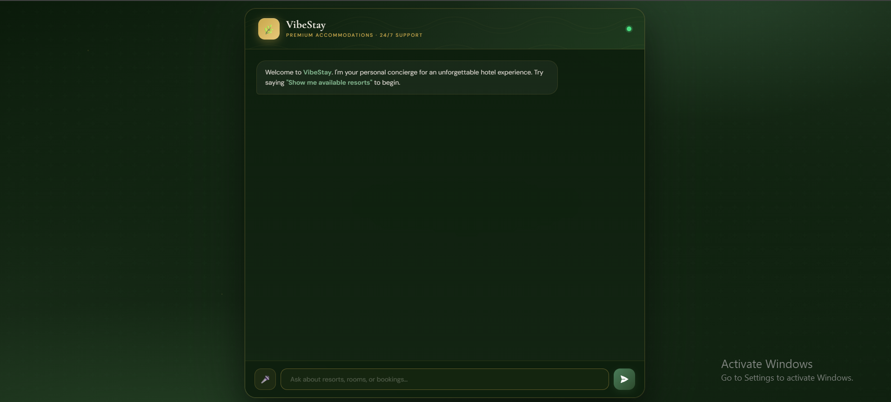
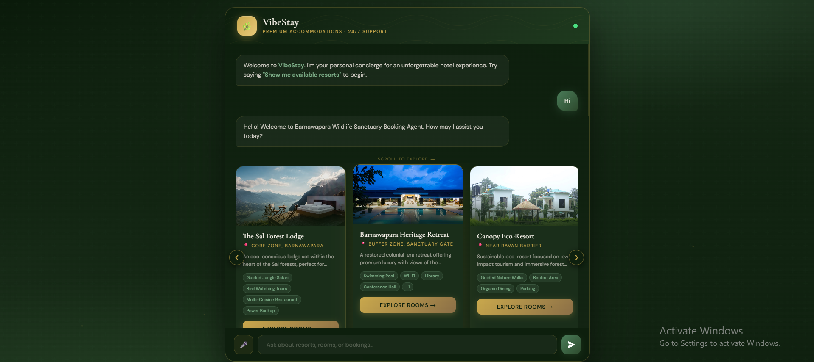
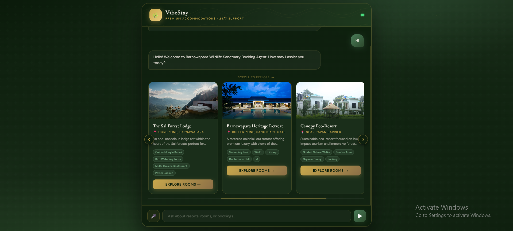
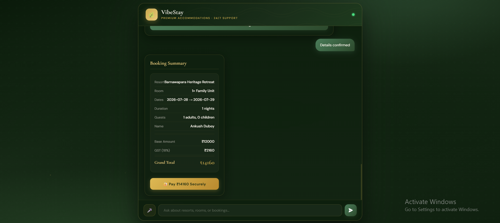

# 🌿 VibeStay – AI-Powered Resort Booking Assistant

<p align="center">


</p>

<p align="center">
An AI-powered conversational resort booking platform that transforms traditional accommodation reservations using intelligent chat, voice interaction, automated availability checking, and seamless booking workflows.
</p>

---

# 📖 Overview

**VibeStay** is an AI-powered hospitality booking assistant designed to simplify accommodation discovery and reservation management for eco-tourism destinations, wildlife sanctuaries, and resort operators.

Unlike traditional booking websites that require users to browse multiple pages and manually compare rooms, VibeStay enables guests to simply **chat** or **speak** with an intelligent AI assistant.

The assistant understands natural language, recommends suitable accommodations, checks room availability, guides users through the booking process, and manages reservations—all through a conversational interface.

The platform supports both **text-based** and **voice-based** interactions, creating an intuitive user experience while reducing the operational workload for resort management.

---

# 🎯 Problem Statement

Many eco-tourism resorts and wildlife accommodations still depend on fragmented booking systems, manual reservation processes, or phone-based customer support.

These approaches often lead to:

- Difficulty discovering suitable accommodations
- Time-consuming booking procedures
- Limited customer support availability
- Double-booking and scheduling conflicts
- Poor user experience for first-time visitors
- Increased management overhead

VibeStay solves these problems by introducing an AI-powered booking assistant capable of handling guest interactions, availability validation, and reservation workflows in real time.

---

# ✨ Key Features

## 🤖 AI Conversational Assistant

- Natural language conversation
- Intelligent resort recommendations
- Accommodation guidance
- Booking assistance
- Resort information retrieval
- Context-aware responses

---

## 🎙️ Voice-Based Booking

- Speech-to-Text using OpenAI Whisper
- Text-to-Speech using Google gTTS
- Hands-free booking experience
- Accessibility-friendly interaction
- Real-time voice conversations

---

## 🏨 Resort Management

- Multi-property support
- Resort information management
- Dynamic room categorization
- Pricing information
- Amenities management
- Occupancy handling

---

## 📅 Availability Management

- Live room availability checking
- Booking conflict prevention
- Reservation validation
- Date-wise occupancy management
- Booking status verification

---

## 💳 Booking Workflow

- Reservation creation
- Booking confirmation
- Payment order generation
- Reservation recording
- Confirmation workflow
- Booking summary generation

---

## 📊 Admin Dashboard

- Secure administrator login
- Booking management
- Reservation history
- Booking monitoring
- Customer reservation records

---
# 🎥 Demo Video

Watch the complete workflow of **VibeStay**, including:

- 🤖 AI Chat Interaction
- 🎙️ Voice-Based Booking
- 🏨 Resort Discovery
- 🛏️ Room Selection
- 💳 Payment Workflow
- ✅ Booking Confirmation

### ▶️ Live Demo

<p align="center">
<a href="https://drive.google.com/file/d/1TkoEohaqA4VMtdar5B-8yoiavXLak_f1/view?usp=drive_link">

</a>
</p>

---

# 📸 Screenshots

## 🏠 Home Page

<p align="center">

</p>

---

## 🤖 AI Chat Assistant

<p align="center">

</p>

---

## 🛏️ Resort Rooms

<p align="center">

</p>

---

## 📋 Booking Summary

<p align="center">

</p>

---

# 🌍 Real-World Applications

VibeStay is designed for modern hospitality and tourism industries, including:

- 🦁 Wildlife Sanctuary Resorts
- 🌿 Eco-Tourism Destinations
- 🏕️ Nature Retreats
- 🏛 Heritage Hotels
- 🏞 Government Tourism Lodges
- 🌎 Smart Hospitality Platforms
- 🛖 Boutique Resorts

---

# 🏗️ System Architecture

```text
                     ┌─────────────────────┐
                     │        User         │
                     └──────────┬──────────┘
                                │
                                ▼
               ┌────────────────────────────────┐
               │   Frontend (Text / Voice UI)   │
               └───────────────┬────────────────┘
                               │
                               ▼
                    ┌───────────────────────┐
                    │    FastAPI Backend    │
                    └───────────┬───────────┘
                                │
        ┌───────────────────────┼────────────────────────┐
        │                       │                        │
        ▼                       ▼                        ▼
┌────────────────┐     ┌─────────────────┐      ┌────────────────┐
│ AI Assistant   │     │ Voice Module    │      │ Booking Engine │
│ NLP Processing │     │ Whisper + gTTS  │      │ Availability   │
└────────────────┘     └─────────────────┘      └────────────────┘
        │                       │                        │
        └───────────────────────┼────────────────────────┘
                                │
                                ▼
                     ┌────────────────────┐
                     │ SQLite Database    │
                     │ Booking Records    │
                     └────────────────────┘
```

---

# 🔄 Booking Workflow

```text
User Query
      │
      ▼
AI Assistant
      │
      ▼
Resort Recommendation
      │
      ▼
Room Selection
      │
      ▼
Availability Check
      │
      ▼
Payment Initiation
      │
      ▼
Booking Confirmation
      │
      ▼
Reservation Stored
```

---
# 🧠 AI Capabilities

The intelligence layer of VibeStay enables users to interact with the platform just like speaking to a travel assistant.

The AI engine is responsible for:

- Understanding user intent
- Conversational booking assistance
- Resort recommendations
- Room selection guidance
- Booking validation
- Reservation support
- Hospitality information retrieval

Instead of navigating multiple webpages, users simply describe their requirements in natural language, and the AI handles the rest.

---

# 🎙️ Voice AI Integration

VibeStay provides a complete voice-enabled booking experience.

## 🎤 Speech-to-Text

User speech is converted into text using:

- OpenAI Whisper

Features:

- High speech recognition accuracy
- Multi-accent support
- Fast inference
- Natural conversation flow

---

## 🔊 Text-to-Speech

AI responses are converted into natural speech using:

- Google Text-to-Speech (gTTS)

Benefits:

- Hands-free booking
- Improved accessibility
- Better mobile experience
- Human-like interaction

---

# 📂 Project Structure

```text
VibeStay/
│
├── main.py
├── requirements.txt
├── resorts.json
├── resorts.csv
├── bookings.db
│
├── templates/
│   ├── index.html
│   └── admin.html
│
├── static/
│
├── uploads/
│
├── screenshots/
│   ├── home.png
│   ├── chatassistant.png
│   ├── rooms.png
│   └── bookingsum.png
│
└── README.md
```

---

# 🛠️ Technology Stack

## 🚀 Backend

- FastAPI
- Uvicorn
- Pydantic

---

## 🤖 AI & Machine Learning

- PyTorch
- Hugging Face Transformers
- Accelerate

---

## 🎙️ Voice Processing

- OpenAI Whisper
- Google Text-to-Speech (gTTS)

---

## 🗄 Database

- SQLite

---

## 📊 Data Processing

- Pandas
- JSON
- CSV

---

## 🎨 Frontend

- HTML
- CSS
- JavaScript

---

# ⚙️ Installation

## 1️⃣ Clone Repository

```bash
git clone https://github.com/yourusername/VibeStay.git

cd VibeStay
```

---

## 2️⃣ Create Virtual Environment

```bash
python -m venv venv
```

---

## 3️⃣ Activate Environment

### Windows

```bash
venv\Scripts\activate
```

### Linux / macOS

```bash
source venv/bin/activate
```

---

## 4️⃣ Install Dependencies

```bash
pip install -r requirements.txt
```

---

# ▶️ Running the Project

## Development Mode

```bash
uvicorn main:app --reload
```

---

## Standard Execution

```bash
python main.py
```

---

Application will start at:

```text
http://127.0.0.1:8000
```

Open the above URL in your browser.

---

# 🔌 API Endpoints

| Method | Endpoint | Description |
|---------|----------|-------------|
| POST | `/chat` | AI conversational assistant |
| POST | `/voice-chat` | Voice-based interaction |
| POST | `/get-booked-dates` | Retrieve unavailable booking dates |
| POST | `/create-payment-order` | Generate payment order |
| POST | `/verify-and-confirm` | Verify payment and confirm reservation |
| GET | `/admin` | Administrator dashboard |
| GET | `/api/bookings` | Fetch booking records |

---

# 📊 Sample Resort Data

The platform currently supports:

- Resort information
- Room categories
- Pricing
- Amenities
- Images
- Occupancy capacity
- Contact details

The architecture is scalable, allowing additional resorts to be added through data files without modifying the application logic.

---

# 🔒 Security Features

- Secure Admin Authentication
- Booking Validation
- Reservation Conflict Prevention
- Error Handling
- API-Based Architecture
- Input Validation
- Data Integrity Checks
- SQLite Transaction Safety

---


# 🚀 Future Enhancements

## Phase 1

- ✅ Razorpay Payment Integration
- 📧 Email Confirmation
- 📱 SMS Notifications
- 🔔 Booking Alerts

---

## Phase 2

- 👤 User Authentication
- ❤️ Personalized Recommendations
- ⭐ Review & Rating System
- 💰 Dynamic Pricing Engine

---

## Phase 3

- 📲 Android & iOS Mobile Application
- 💬 WhatsApp Booking Assistant
- 🌍 Multi-language Support
- 📊 Analytics Dashboard
- 🤖 LLM-based Smart Travel Planner

---

# ⭐ Project Highlights

- 🤖 AI-Powered Resort Booking Assistant
- 🎙️ Voice-Based Reservation System
- ⚡ FastAPI Backend
- 🧠 Natural Language Processing
- 🎤 Whisper Speech Recognition
- 🔊 Google Text-to-Speech
- 📅 Real-Time Availability Checking
- 💳 Automated Booking Workflow
- 🗄️ SQLite Database
- 📊 Admin Dashboard
- 🌿 Eco-Tourism Use Case
- 📈 Scalable Architecture

---

# 🤝 Contributing

Contributions are welcome!

If you'd like to improve VibeStay:

1. Fork this repository
2. Create a new feature branch

```bash
git checkout -b feature/NewFeature
```

3. Commit your changes

```bash
git commit -m "Added new feature"
```

4. Push to GitHub

```bash
git push origin feature/NewFeature
```

5. Open a Pull Request

---

## 📜 License

This project is licensed under the **MIT License**.

See the [LICENSE](LICENSE) file for details.

---

# 👨‍💻 Author

**Developed with ❤️ using FastAPI, Whisper, and AI Technologies**

If you found this project useful, feel free to connect and collaborate!

---

# 🌟 Support

If you like this project, consider giving it a ⭐ on GitHub.

It helps others discover the project and motivates future improvements.

<p align="center">

## ⭐ Star this Repository ⭐

</p>

---

<p align="center">

Made with ❤️ for Smart Hospitality & AI-Powered Tourism

</p>
